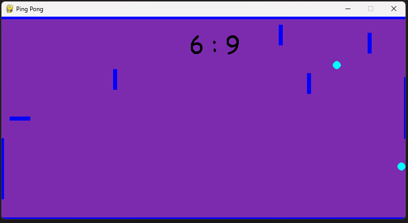

# Ping - Pong

## Table of contents
* [General info](#general-info)
* [Install requirements](#install-requirements)
* [Run app](#run-app)
* [How to play](#how-to-play)
    - [Moves](#moves)
    - [Score](#score)
    - [Additional elements](#additional-elements)
    - [Configurations](#configurations)
* [Screenshots](#screenshots)
* [Multithreading](#multithreading)
    - [Threads](#threads)
    - [Critical sections](#critical-sections)

## General info
### Multithreaded python app for SO2 project
*by Kamil Bauer & Damian Gnieciak*

## Install requirements
```bash
pip3 install -r requirements.txt
```

## Run app
```bash
python3 ./src/App.py
```

## How to play
Simple 2D Ping-Pong game for two players.

### Moves
Left player moves with W (up) and S (down) keys, right player moves with Up-Arrow (up) and Down-Arrow (down).

### Score
To get a point player has to put the ball in the opposing player's gate.

### Additional elements
Additional balls and obstacles appear over time. Frequency can be configured using settings file.

### Configurations
All configurations like 
- board size, 
- players size, 
- balls speed 
- respawn frequency

can be changed using settings class inside ./src/Settings.py file.

## Screenshots



## Multithreading

### Threads
In app following threads exist:
* BallManager - thread responsible for addings new balls
* ObstacleManager - thread responsible for addings new obstacles
* Ball - each ball is responsible for movement of itself

### Critical sections
In app following critical sections exist:
* Collections of balls in BallManager - for adding new balls and reading positions of existing ones
* Collections of obstacles in ObstacleManager - for adding new obstacles and reading positions of existing ones
* Each player in PlayerManager - for adding points and reading score
* Coordinates of each Point - for reading and setting 